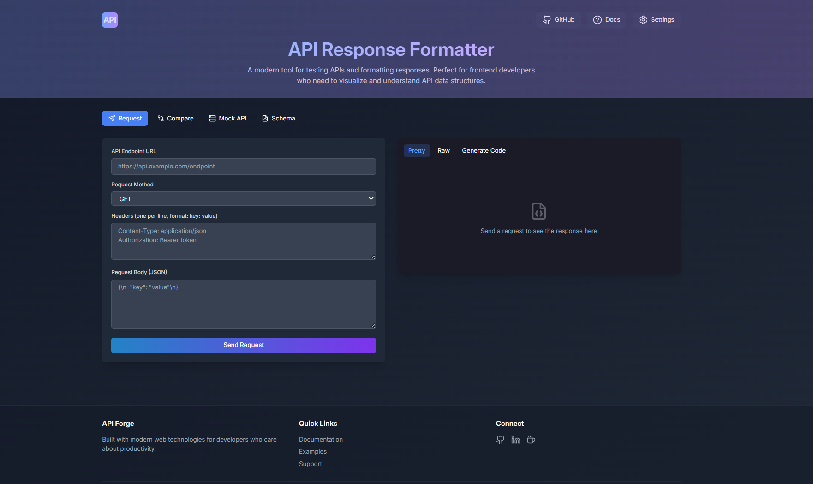

# API Forge 🚀

A modern, powerful API testing and response formatting tool built for frontend developers. With API Forge, you can easily test endpoints, validate responses, and generate mock APIs - all with a beautiful, intuitive interface.



## ✨ Features

- 🎨 **Beautiful Interface**: Dark mode by default with smooth animations
- 🔍 **API Testing**: Test any endpoint with custom headers and request bodies
- 📊 **Response Formatting**: Auto-format and syntax highlight JSON responses
- ✅ **Schema Validation**: Validate responses against JSON schemas
- 🔄 **Response Comparison**: Compare responses with visual diff highlighting
- 🎭 **Mock API Generation**: Create mock APIs with customizable templates
- 💾 **Export Options**: Save responses as JSON, HTML, or Markdown
- 📱 **Responsive Design**: Works seamlessly on all devices

## 🔥 Live Demo

Try it out: [API Forge Live Demo](https://alexfrontendfr.github.io/api-forge)

## 🛠️ Quick Start

```bash
# Clone the repository
git clone https://github.com/alexfrontendfr/api-forge.git

# Enter the project directory
cd api-forge

# Install dependencies
npm install

# Start development server
npm run dev
```

## 📖 Usage Examples

### Basic API Testing

```bash
# Test a GET request
1. Enter URL: https://api.example.com/users
2. Select GET method
3. Add headers (if needed)
4. Click "Send Request"
```

### Schema Validation

```json
{
  "type": "object",
  "properties": {
    "id": { "type": "number" },
    "name": { "type": "string" }
  }
}
```

### Mock API Generation

```javascript
// Generated mock API endpoint
app.get("/api/users", (req, res) => {
  res.json([
    { id: 1, name: "John Doe" },
    { id: 2, name: "Jane Smith" },
  ]);
});
```

## 🚀 Deployment

Deploy to GitHub Pages in one command:

```bash
npm run deploy
```

## 🤝 Contributing

Contributions are welcome! Please feel free to submit a Pull Request.

1. Fork the repository
2. Create your feature branch (`git checkout -b feature/AmazingFeature`)
3. Commit your changes (`git commit -m 'Add AmazingFeature'`)
4. Push to the branch (`git push origin feature/AmazingFeature`)
5. Open a Pull Request

## 📝 License

Distributed under the MIT License. See `LICENSE` for more information.

## 👤 Author

**Alex Iulian**

- GitHub: [@alexfrontendfr](https://github.com/alexfrontendfr)
- LinkedIn: [@alex-iulian-dev](https://www.linkedin.com/in/alex-iulian-dev/)

## ⭐️ Support

If you found this project useful, please consider giving it a star on GitHub and sharing it with your network!
